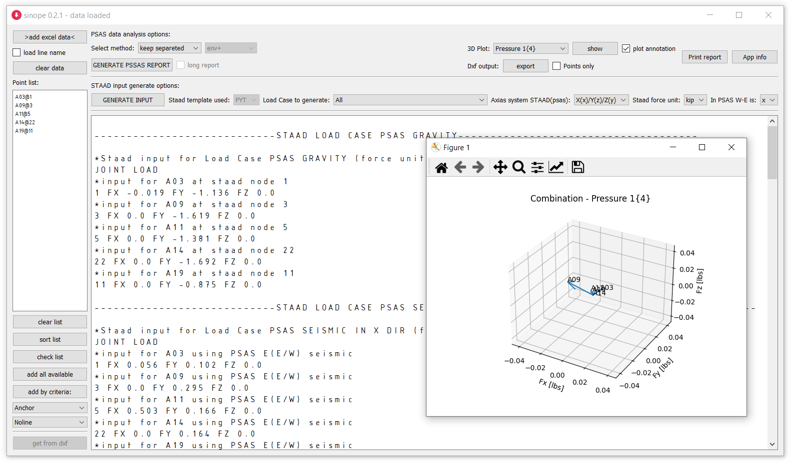

Sinope - J-MEPCon stress pipe reaction analysis app
---------------------------------------------------

`Download binaries for Windows <https://github.com/lukaszlaba/sinope/releases>`_

Changelog
---------

Sinope 0.0.1 (poc stage for testing)
  - proof of concept stage

Description
-----------

Sinope is a J-MEPCon dedicated tool that help analyse mech pipe stress reactions and transfer them to Staad model. Sinope make easy to find simplified equivalen pipe reactions.

How to run it
-------------

Windows binaries available. Just download it and run exe file.
Link to windows binaries download is shown below.

https://github.com/lukaszlaba/sinope/releases

You can also run it by using Python engine. After the Python and needed libraries was installed, just run sinope.py file. Soco is  based on Python 3 and non-standard Python libraries PyQt5, matplotlib, pandas.

License
-------

Copyright (C) 2023 Łukasz Laba <lukaszlaba@gmail.com>

Sinope is free software; you can redistribute it and/or modify
it under the terms of the GNU General Public License as published by
the Free Software Foundation; either version 2 of the License, or
(at your option) any later version.

Sinope is distributed in the hope that it will be useful,
but WITHOUT ANY WARRANTY; without even the implied warranty of
MERCHANTABILITY or FITNESS FOR A PARTICULAR PURPOSE.  See the
GNU General Public License for more details.
